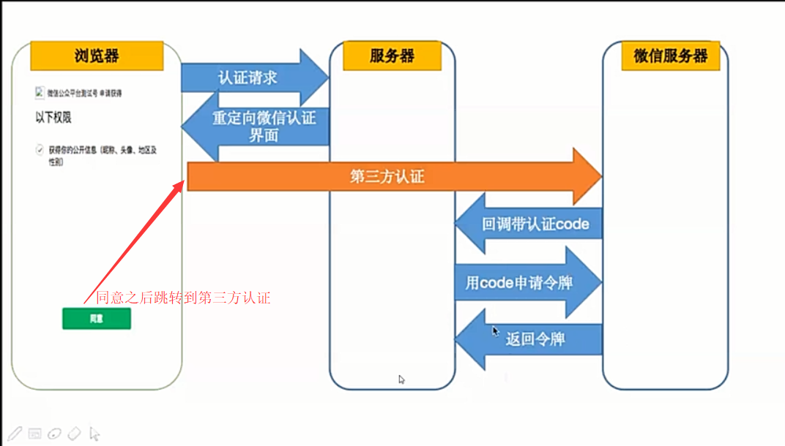
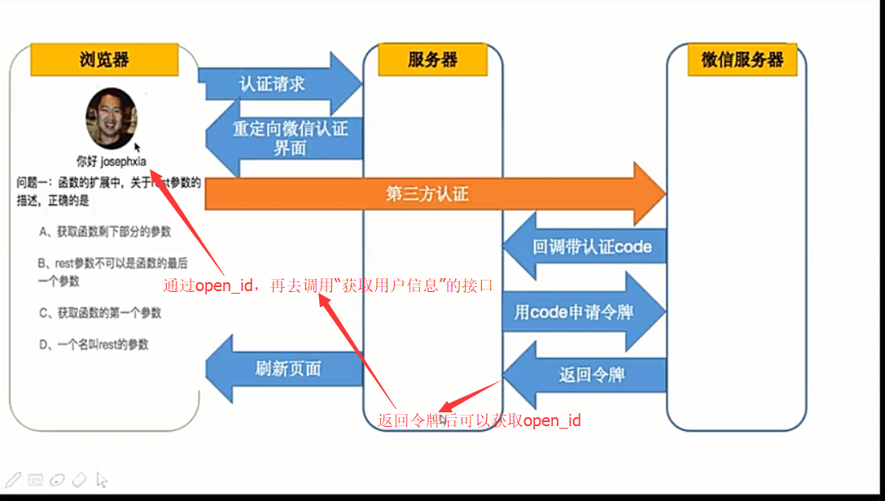

# 微信公众号
## 开发环境
1. 注册微信订阅号 <https://mp.weixin.qq.com/>
2. sunny-ngrok (内网穿透tunnel) <https://www.ngrok.cc/>
## 公众号服务端
1. 客服消息
    - 方法1: 微信公众号平台设置 <https://mp.weixin.qq.com/cgi-bin/frame?t=advanced/dev_tools_frame&nav=10049&token=1003798924&lang=zh_CN>
    - 方法2: 开通公众号测试账号 <http://mp.weixin.qq.com/debug/cgi-bin/sandboxinfo?action=showinfo&t=sandbox/index>, 借助`npm i co-wechat -S`, 在自己的服务器写代码实现
2. 验证 -- 我们的服务器验证微信
3. 服务器端调用微信API
    - 方法1: 微信公众号平台设置 <https://mp.weixin.qq.com/cgi-bin/frame?t=advanced/dev_tools_frame&nav=10049&token=1003798924&lang=zh_CN>
    - 方法2: 微信公众号开发文档 <https://developers.weixin.qq.com/doc/offiaccount/Getting_Started/Overview.html>, 借助 `npm i 'co-wechat-api -S`
4. 多进程下保存 token 全局票据
    - 将 token 保存到数据库
## 公众号网页端
### 一、网页授权获取用户基本信息
1. 原理 -- OAuth2.0  
  
  

2. 开发过程
- 2.1 微信公众号平台授权
    - 2.1.1 获取 “网页授权 -- 网页授权获取用户基本信息” 的权限 
        - <https://mp.weixin.qq.com/advanced/advanced?action=table&token=1899850966&lang=zh_CN>
        - 有一个疑问：服务号支持，订阅号不支持？
    - 2.1.2 修改授权回调域名
        - <https://mp.weixin.qq.com/debug/cgi-bin/sandboxinfo?action=showinfo&t=sandbox/index>
- 2.2 借助 `npm i co-wechat-oauth -S` 开发
    - 2.2.1 生成用户URL： `oauth.getAuthorizeURL`
    - 2.2.2 获取用户回调 AccessToken 与 OpenId
    ```javascript
    let token = await oauth.getAccessToken(code)
    let accessToken = token.data.access_token
    let openid = token.data.openid
    ```
    - 2.2.3 用户信息: `let userInfo = oauth.getUser(openid)`
    - 2.2.4 AccessToken缓存: 保存到数据库
## 二、JSSDK


