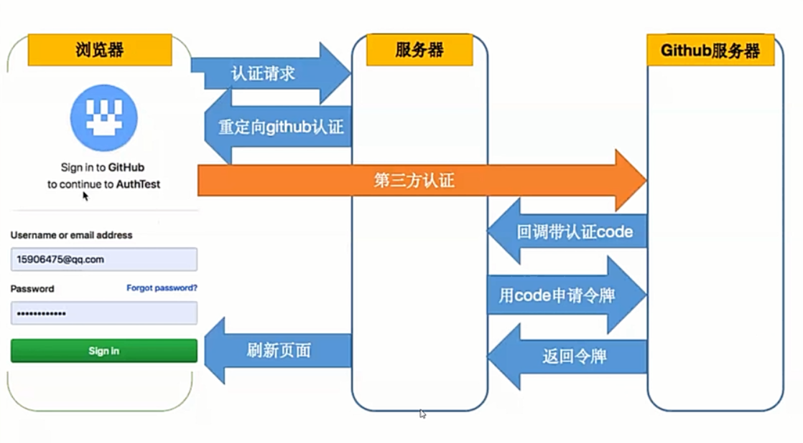

# 鉴权
## 一、Session/Cookie
1. cookie
    - 1.1 原理 `res.setHeader('Set-Cookie', 'cookie1 = abc')`
    - 1.2 不足 长度有限；用户可以篡改（所以有了Session）
2. Session
    - 2.1 原理
        - 客户端首次访问服务器
            - 服务器用cookie的形式给客户端发送sessionID
            - 服务器的sessionID和用户是一一对应的
        - 客户端再次访问服务器
            - 客户端带上sessionID
            - 服务器通过认证sessionID，从而鉴权
    - 2.2 不足
        - 服务器有状态
        - 不灵活：Session基于Cookie，而Cookie又只存在于浏览器，如果是APP怎么办? 
## 二、Token-JWT
1. Token 原理解析
    - 客户端保存（存入cookie或localStorage）着服务的签发的Token（服务器无状态，所有数据都保存在客户端）
    - 客户端每次与服务器通信，都要带上这个 Token。放在 Cookie 里面的 Token 会自动发送，但是这样不能跨域，所以更好的做法是放在 HTTP 请求的头信息Authorization字段里面。`Authorization: Bearer <token>`
    - 服务端收到请求，然后去验证客户端请求⾥⾯带着的 Token，如果验证成功，就向客户端返回请求的数据
2. JWT(JSON WEB TOKEN)原理解析 <http://www.ruanyifeng.com/blog/2018/07/json_web_token-tutorial.html>
    - 2.1 Bearer Token包含三个组成部分：Header(头部), Payload（负载）, Signature（签名）
    ```javascript
    eyJhbGciOiJIUzI1NiIsInR5cCI6IkpXVCJ9.eyJkYXRhIjp7InVzZXJuYW1lIjoiYWJjIiwicGFzc3dvcmQiOiIxMT
    ExMTEifSwiZXhwIjoxNTU3MTU1NzMwLCJpYXQiOjE1NTcxNTIxMzB9.pjGaxzX2srG_MEZizzmFEy7JM
    3t8tjkiu3yULgzFwUk
    ```
    - Header: 一个 JSON 对象，描述 JWT 的元数据 `{"alg":"HS256","typ":"JWT"}`
    - Payload: 一个 JSON 对象，用来存放实际需要传递的数据，比如：
    ```javascript
    {
        "data":
        {"username":"xu",
        "password":"123456"},
        "exp":1598861204, //过期时间
        "iat":1598857604 //签发时间
    }
    ```
    - Signature 部分是对前两部分的签名，防止数据篡改
        - 首先，需要指定一个密钥（secret）。这个密钥只有服务器才知道，不能泄露给用户
        - 然后，使用 Header 里面指定的签名算法（默认是 HMAC SHA256），按照下面的公式产生签名 `HMACSHA256(base64UrlEncode(header)+ "." +base64UrlEncode(payload), secret)`
    - 算出签名以后，把 Header.Payload.Signature 组合成 Token 返回给用户
3. 不足
    - JWT 默认是不加密，但也是可以加密的。生成原始 Token 以后，可以用密钥再加密一次。JWT 不加密的情况下，不能将私密数据写入 JWT
    - JWT 的最大缺点是，由于服务器不保存 session 状态，因此无法在使用过程中废止某个 token，或者更改 token 的权限。也就是说，一旦 JWT 签发了，在到期之前就会始终有效，除非服务器部署额外的逻辑
    - 为了减少盗用，JWT 不应该使用 HTTP 协议明码传输，要使用 HTTPS 协议传输
## 三、OAuth(开发授权，第三方登录)
  

## 四、SSO（单点登录）
1. 定义：单点登录SSO（Single Sign On）说得简单点就是在一个多系统共存的环境下，用户在一处登录后，就不用在其他系统中登录，也就是用户的一次登录能得到其他所有系统的信任（比如阿里巴巴）。
2. 原理：一般说来，大型应用会把授权的逻辑与用户信息的相关逻辑独立成一个应用，称为用户中心。用户中心不处理业务逻辑，只是处理用户信息的管理以及授权给第三方应用。第三方应用需要登录的时候，则把用户的登录请求转发给用户中心进行处理，用户处理完毕返回凭证，第三方应用验证凭证，通过后就登录用户。  

