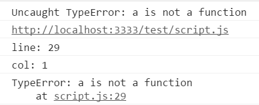
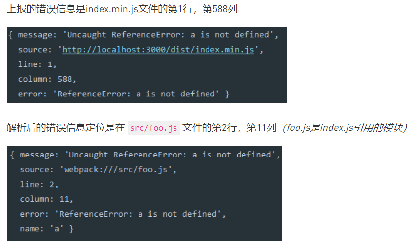

# 性能优化
## 一、从输⼊url到显示⻚⾯，发⽣了什么
1. 网络通信阶段
    - 1.1 用户输入网址
    - 1.2 浏览器通过 DNS ，把 url 解析成 IP
    - 1.3 浏览器和 IP 地址建立 TCP 连接（三次握手），发送 HTTP 请求
    - 1.4 服务器接收请求（可能有重定向），处理请求（比如反向代理，查库，读文件等），拼接好（网页源代码）返回的 HTTP 响应
2. 页面渲染阶段
    - 2.1 浏览器收到首屏 html, 开始渲染
    - 2.2 构建 DOM 树，根据 html 结构生成 DOM 树
        - 遇到 `<script>` 标签，会阻塞渲染，转而去执行 `<script>` 里面的代码
        - 遇到外部js文件，图片等，会发送 HTTP 请求，异步加载
    - 2.3 生成样式表，根据 css 文件和元素上的 inline 样式生成样式表
        - CSS 的解析是从右往左逆向解析的，嵌套标签越多，解析越慢
    - 2.4 构建 Render 树，将 DOM 树和样式表关联起来，构建一棵 Render 树
        - DOM 树，CSS 样式表和 Render 树，这三个过程不是独立渐进的，它们会有交叉，会一边加载，一边解析，以及一边渲染
    - 2.5 绘制页面，根据 Render 树和节点显示坐标，调用每个节点的 *paint* 方法，将它们绘制出来
        - JS 操作真实 DOM, 可能会引起页面的重排和重绘，因此代价是巨大的
> 所谓性能优化，就是上⾯的步骤加⼀起，时间尽可能的短
## 二、性能优化
1. 网络层面
    - 1.1 减少 DNS 查询
        - DNS预解析, 缓存 DNS 查询记录, 比如淘宝首页: `<link rel="dns-prefetch" href="//g.alicdn.com" />`
    - 1.2 减少HTTP请求
        - 1.2.1 静态资源独立部署（CDN）（也可以利用CDN来缩短⽤户和服务器的距离）
        - 1.2.2 静态资源合并（JS，CSS...）
        - 1.2.3 缓存
            - CDN 缓存
            - HTTP 缓存（强缓存和协商缓存）
        - 1.2.4 本地存储
            - cookie, Local Storage, Session Storage
    - 1.3 请求过程的优化
        - 1.3.1 图片优化
            - 根据场景选用合适的图片格式（png, JPG/JPEG, gif, webP,svg，base64...）
                - PNG: logo，颜⾊简单但对图⽚质量要求较⾼
                - JPG/JPEG: 背景图，大的轮播 banner 图
                - GIF：loading 图
                - SVG：绘制地图，股票k线图等
                - WebP：全能，缺点就是兼容性不好
                - Base64：因为图⽚base64之后会变⼤，所以适合⼩的⽮量图标
            - 使用 Sprite, css3, iconfont等技术
            - 图片压缩
        - 1.3.2 压缩：服务端设置 Gzip 压缩
        - 1.3.3 Cookie: 减少 Cookie 体积
2. 渲染层面
    - 2.1 提高首屏渲染速度
        - 2.1 同构: 首屏 SSR + 交互 CSR (SPA)
        - 2.2 按需加载，懒加载，事件节流和防抖
            - 节流：隔⼀段时间只触发⼀次
            - 防抖: 完成后再统⼀发送请求
        - 2.3 HTML5 Web Works
            - web works 是运行在后台的Javascript，脱离于浏览器窗体，算是幕后⼯作，可以实现离线缓存
        - ⽩屏应对
            - 先展示骨架（比如antd的skeleton组件）
            - ⾃动化⽅案：page-skeleton-webpack-plugin
    - 2.2 CSS 性能方案
        - CSS 样式文件引入放在`<header>`里
        - CSS 选择器优化
            - 选择器嵌套不超过三层
            - 不使用标签选择器
    - 2.3 JS 性能方案
        - 把脚本放到底部
        - 减少 DOM 操作
            - 链式操作
            - 批量操作（比如字符串拼接）
            - 在 DOM 树外更新节点，然后添加到 DOM 树（虚拟DOM）
        - 减少重排(回流)和重绘
            - 重排: 当我们对 DOM 的修改引发了 DOM ⼏何尺⼨的变化(（⽐如修改元素的宽、⾼或隐藏元素等)
            - 重绘：当我们对 DOM 的修改导致了样式的变化、却并未影响其⼏何属性（⽐如修改了颜⾊或背景⾊）
3. 性能监测
    - Performance API：直接在浏览器控制台输入`Window.performance`来查看
    - 工具：lighthouse
        - 安装：`npm install -g lighthouse`
        - 使用（以淘宝为例）：命令行终端输入 `lighthouse https://www.taobao.com/`
## 三、移动端优化技巧
1. 虚拟列表 vitural-list
    - react-virtualized <https://github.com/bvaughn/react-virtualized>
## 四、Vue 项目性能优化
1. 异步加载组件(重要)
2. 根据场景合理使用 v-if 和 v-show
3. 和渲染无关的数据,不要放在 data 上
## 五、React 项目性能优化
1. Purecomponent
## 六、其它
1. 前端错误监控
    - 1.1 try/catch
        - try/catch只能捕捉同步代码抛出的错误，不能捕捉异步代码抛出的错误
    - 1.2 window.onerror
        - try/catch有一个弊端就是对每一个函数都需要进行try/catch捕捉再进行处理, 其实可以使用一个全局的error事件来捕获所有的error
        ```javascript
        window.onerror = function(message, source, lineno, colno, error) {
            // 错误信息，源文件，行号
            console.log(message + '\n' + source + '\n' + lineno);
            // 禁止浏览器打印标准的错误信息
            return true;
        }
        ```
    - 1.3 网络异常捕捉 —— 网络异常可以在事件捕获的阶段捕捉到，通过window.addEventListener来实现，代码必须放在文档载入之前
    ```javascript
    // ie11和主流浏览器
    window.addEventListener('error', function(e) {
        e.stopImmediatePropagation();
        const srcElement = e.srcElement;
        if (srcElement === window) {
            // 全局错误
            console.log(e.message)
        } else {
            // 元素错误，比如引用资源报错
            console.log(srcElement.tagName)
            console.log(srcElement.src);
        }
    }, true)
    ```
    - 1.4 Promise错误捕捉: `pro.then(res => {}, err => {})`
    - 1.5 Async/await错误捕捉 —— 通过try/catch处理同步或者异步的错误
    - 1.6 Script error
        - 如果引用外链不同源的js文件，外链不同源js文件报错，onerror只会提示Script error，无法精确到指定文件和行数，可以通过script标签的crossorigin="anonymous"，比如：`<script type="text/javascript" src="http://localhost:3000/test/script.js" crossorigin="anonymous"></script>` 设置了该属性的话，那么需要在服务器对响应的静态文件设置Access-Control-Allow-Origin:*响应头。这样就可以捕捉到script.js文件的的错误信息，如下：  
        

    - 1.7 压缩js的错误定位
        - 通过node提供的 source-map 模块来定位上报错误信息对应源文件错误的行号, 如下：
        
    
