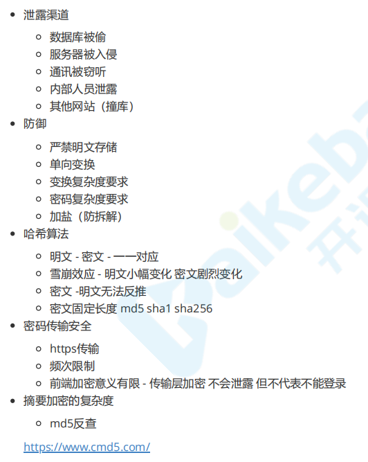
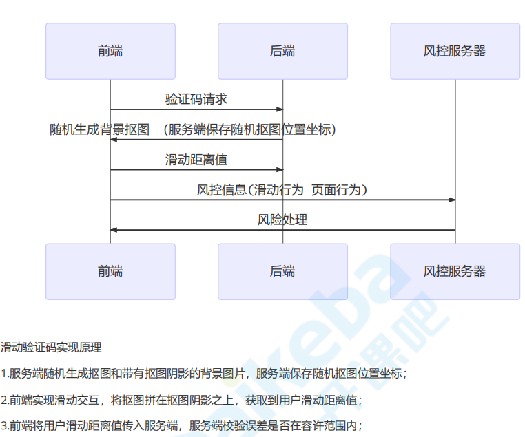
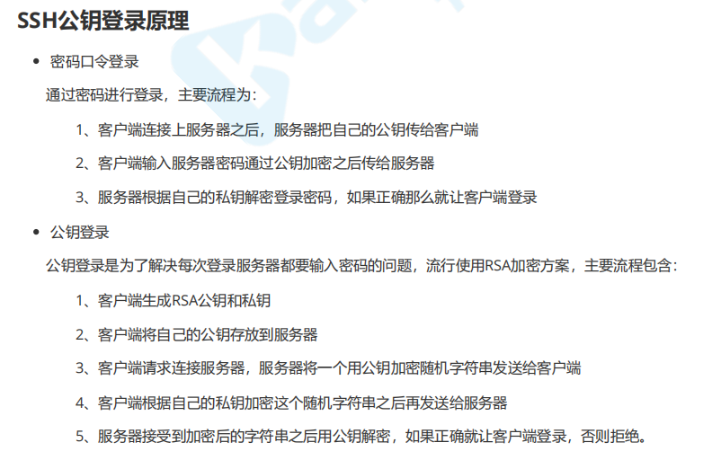
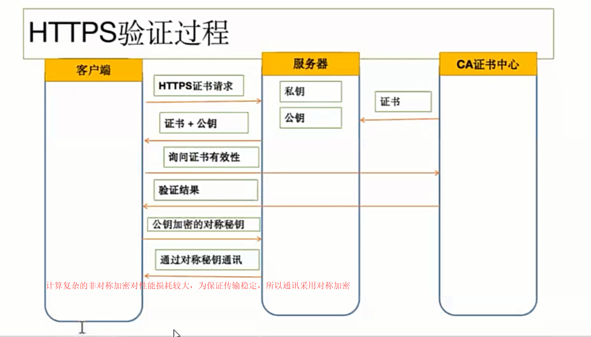

# 网络安全
## 一、常见 web 攻击及其防御手段
1. XSS (Cross Site Scripting) 跨站脚本攻击
    - 1.1 定义：向存在安全漏洞的网站运行非法的非本站点的HTML标签或JavaScript
    - 1.2 危害
        - 利用虚假输入表单骗取用户个人信息
        - 利用脚本窃取用户 cookie
    - 1.3 攻击方式
        - 反射型：url 参数直接注入
            - 分析：比如，将用户的浏览器url地址变成： `http://localhost:3000/?from=<script src="http://localhost:4000/hack.js"></script>`，有时，为了让后面的网址没有那么可疑，攻击者会进行短域名伪造 <https://dwz.cn/>
        - 存储性：存储到 DB 后读取时注入
            - 分析: 比如，攻击者在某个表单输入 `我来了<script src="http://localhost:4000/hack.js"></script>`
    - 1.4 防御手段
        - 1.4.1 ejs转义
            - 前端方面
                - 一些前端框架、模板引擎框架自带 ejs 转义
                - 浏览器默认开启 ejs 转义
            - 后端方面: 前端传过来的永远不可信任的，最普遍的做法就是转义输入输出的内容，对于引号、尖括号、斜杠进行转义
                - 黑名单: 转义所有字符
                ```javascript
                function escape(str) { 
                    str = str.replace(/&/g, '&amp;') 
                    str = str.replace(/</g, '&lt;') 
                    str = str.replace(/>/g, '&gt;') 
                    str = str.replace(/"/g, '&quto;') 
                    str = str.replace(/'/g, '&#39;') 
                    str = str.replace(/`/g, '&#96;') 
                    str = str.replace(/\//g, '&#x2F;') 
                    return str 
                }
                ```
                - 白名单：有需要的格式不进行转义
                ```javascript
                const xss = require('xss')
                let html = xss('<h1 id="title">XSS Demo</h1><script>alert("xss");</script>')
                console.log(html)
                // <h1>XSS Demo</h1>&lt;script&gt;alert("xss");&lt;/script&gt;
                ```
        - 1.4.2 CSP(Content Security Policy) 内容安全策略
            - 定义：CSP 本质上就是建立白名单，开发者明确告诉浏览器哪些外部资源可以加载和执
            - 方法
            ```javascript
            ctx.set('Content-Security-Policy', "default-src 'self'")
            // 只允许加载本站资源
            Content-Security-Policy: default-src 'self'
            // 只允许加载 HTTPS 协议图片
            Content-Security-Policy: img-src https://*
            // 不允许加载任何来源框架
            Content-Security-Policy: child-src 'none'
            ```
        - 1.4.3 HttpOnly Cookie
2. CSRF(Corss Site Request Forgery) 跨站请求伪造
    - 2.1 定义：攻击者利用用户已登陆的身份，在用户不知情的情况下，以用户的名义完成非法操作
    - 2.2 危害
        - 利用用户登录态，用户不知情
        - 冒充用户发帖
        - 完成业务请求（比如盗取用户资金）
    - 2.3 攻击方式
        - 比如在用户已登陆的网页并没有退出的情况下，诱导用户点击某个链接，然后在该网页嵌入一个`<iframe>`，`<iframe>`里面写着一些伪造请求的逻辑
    - 2.4 防御手段（以下四种都是在后台实现）
        - 2.4.1 Referer Check：后台通过 Referer Check检查请求的来源网址，如果不是用户的网址，则拒绝。（但是：Https不发送referer）
        ```javascript
        app.use(async (ctx, next) => { 
            await next() const referer = ctx.request.header.referer 
            console.log('Referer:', referer) 
        })
        ```
        - 2.4.2 验证码
        - 2.4.3 cookie值进行hash: 攻击者在访问信任网站A时，虽然浏览器可以在请求中带上 cookie ,但是网站A确不仅仅通过cookie来判断用户身份，同时通过用户发送过来的内容中的伪随机数来判断请求真正是用户发送的。攻击者在请求A的时候，不能在提交的内容中产生伪随机数
        - 2.4.4 禁止第三方携带cookie
3. click jacking 点击劫持
    - 3.1 定义：点击劫持是一种视觉欺骗的攻击手段。攻击者将需要攻击的网站通过 iframe 嵌套的方式嵌入自己的网页中，并将 iframe 设置为透明，在页面中透出一个按钮诱导用户点击。即攻击者不盗取用户任何信息，只是诱导用户完成某个操作（比如点赞）
    - 3.2 防御手段
        - 前端方面
        ```html
        <head> 
            <style id="click-jack"> 
            html { display: none !important; } 
        </style> 
        </head> 
        <body> 
            <script>
            // self是当前窗口自身的引用，与window属性等价
            // top 返回顶层窗口，即浏览器窗口
            if (self == top) { 
                 var style = document.getElementById('click-jack') 
                 document.body.removeChild(style) 
            } else { 
                top.location = self.location 
            } 
            // 以上代码的作用就是当通过 iframe 的方式加载页面时，攻击者的网页直接不显示所有内容了。
            </script> 
        </body>
        ```
        - 后端方面 X-FRAME-OPTIONS
            - X-FRAME-OPTIONS 是一个 HTTP 响应头，在现代浏览器有一个很好的支持。这个 HTTP 响应头 就是为了防御用 iframe 嵌套的点击劫持攻击。
        ```javascript
        // DENY，表示页面不允许通过 iframe 的方式展示
        // SAMEORIGIN，表示页面可以在相同域名下通过 iframe 的方式展示
        // ALLOW-FROM，表示页面可以在指定来源的 iframe 中展示
        ctx.set('X-FRAME-OPTIONS', 'DENY')
        ```
4. SQL注入
    - 4.1 攻击方式
    ```javascript
    // 填入特殊密码 
    '1' or '1'='1'
    // 拼接后的SQL 
    SELECT * FROM test.user 
    WHERE username = 'laowang' 
    AND password = '1' or '1'='1'
    ```
    - 4.2 防御手段
        - 4.2.1 所有的查询语句建议使用数据库提供的**参数化查询接口**
        ```javascript
        // 错误写法 
        const sql = `
            SELECT * FROM test.user 
            WHERE username = '${ctx.request.body.username}' 
            AND password = '${ctx.request.body.password}' 
        `
        // 正确的写法
        const sql = `
        SELECT *
        FROM test.user
        WHERE username = ? 
        AND password = ?
        res = await query(sql,[ctx.request.body.username, ctx.request.body.password])
        ```
        - 4.2 后端代码检查输入的数据是否符合预期, 例如使用正则表达式进行一些匹配处理
        - 4.3 对进入数据库的特殊字符（'，"，\，<，>，&，*，; 等）进行转义处理，或编码转换
5. OS命令注入
    - 5.1 定义：OS命令注入和SQL注入差不多，只不过SQL注入是针对数据库的，而OS命令注入是针对操作系统的。OS命令注入攻击指 通过Web应用，执行非法的操作系统命令达到攻击的目的。只要在能调用Shell函数的地方就有存在被攻击的风险。倘 若调用Shell时存在疏漏，就可以执行插入的非法命令。
    - 5.2 攻击方式
    ```javascript
    // 以 Node.js 为例，假如在接口中需要从 github 下载用户指定的 repo
    const exec = require('mz/child_process').exec;
    let params = {/* 用户输入的参数 */};
    exec(`git clone ${params.repo} /some/path`);
    // 如果攻击者传入下面的参数，则会把数据库所有的数据删除
    // https://github.com/xx/xx.git && rm -rf /* &&
    ```
    - 5.3 防御手段：同sql注入
6. 请求劫持
    - 6.1 DNS劫持 
        - 定义：DNS服务器(DNS解析各个步骤)被篡改，修改了域名解析的结果，使得访问到的不是预期的ip
    - 6.2 HTTP劫持（运营商劫持）
        - 防御手段：大概只能升级HTTPS了
7. DDOS
    - <http://www.ruanyifeng.com/blog/2018/06/ddos.html>
    - 7.1 定义: DDOS 不是一种攻击，而是一大类攻击的总称。网站运行的各个环节，都可以是攻击目标。只要把一个环节攻破，使得整个流程跑不起来，就达到了瘫痪服务的目的。
    - 7.2 攻击方式：
        - SYN Flood：此攻击通过向目标发送具有欺骗性源IP地址的大量TCP“初始连接请求”SYN数据包来利用TCP握手。目标机器响应每个连接请求，然后等待握手中的最后一步，这一步从未发生过，耗尽了进程中的目标资源
        - HTTP Flood：此攻击类似于同时在多个不同计算机上反复按Web浏览器中的刷新 - 大量HTTP请求泛滥服务器，导致拒绝服务
    - 7.3 防御手段
        - 备份网站
            - 备份网站不一定是全功能的，如果能做到全静态浏览，就能满足需求。最低限度应该可以显示公告，告诉用户，网 站出了问题，正在全力抢修。
        - HTTP 请求的拦截 高防IP
            - 靠谱的运营商（比如阿里云）、 防火墙
        - 带宽扩容 + CDN
            - 提高犯罪成本
## 二、安全防范
1. 密码强化  
  

2. 人机识别
 

3. HTTPS
    - 3.1 HTTPS = HTTP + SSL证书
        - SSL证书：SSL证书由浏览器中“受信任的根证书颁发机构”在验证服务器身份后颁发,具有网站身份验证和加密传输双重功能
        - SSH 公钥登陆原理  
         

        - https验证流程  
         

        - https加密原理 <https://www.techug.com/post/https-ssl-tls.html>
4. 浏览器安全控制
    - X-XSS-Protection：防止反射型XSS（浏览器默认开启）
    - Strict-Transport-Security：强制使用HTTPS通信
    - HTTP 响应头 Content-Security-Policy 
    ```html
    <meta http-equiv="Content-Security-Policy" content="default-src 'self'; img-src https://*; child-src 'none';">
    ```
        - <https://developer.mozilla.org/zh-CN/docs/Web/HTTP/Headers/Content-Security-Policy>
        - <https://juejin.im/post/5c6ad29ff265da2da00ea459>
5. 后端 CSP -- helmet 中间件
    - 借助 helmet 中间，开启所有安全策略，比如：
    ```javascript
    // npm i koa-helmet -s
    const Koa = require("koa"); 
    const helmet = require("koa-helmet"); 
    const app = new Koa();

    app.use(helmet())
    // 使用该中间件会开启以下特性：
    // X-XSS-Protection：开启大多现代浏览器内建的对于跨站脚本攻击（XSS）的过滤功能
    // Content-Security-Policy：防止受到跨站脚本攻击以及其他跨站注入攻击
    // X-Frame-Options：提供对于“点击劫持”的保护
    // Strict-Transport-Security：强制使用安全连接（SSL/TLS之上的HTTPS）来连接到服务器
    // X-Content-Type-Options： 防止浏览器使用MIME-sniffing来确定响应的类型，转而使用明确的content-type来确定
    // ...
    ```
6. Session 管理
    - 对于cookie的安全使用，其重要性是不言而喻的。
    - Cookie标示
        - secure: 这个属性告诉浏览器，仅在请求是通过HTTPS传输时，才传递cookie
        - HttpOnly: 设置这个属性将禁止 javascript 脚本获取到这个cookie，这可以用来帮助防止跨站脚本攻击。
    - Cookie域
        - domain: 这个属性用来比较请求URL中服务端的域名。如果域名匹配成功，或这是其子域名，则继续检查 path 属性
        - path:  除了域名，cookie可用的URL路径也可以被指定。当域名和路径都匹配时，cookie才会随请求发送
        - expires: 这个属性用来设置持久化的cookie，当设置了它之后，cookie在指定的时间到达之前都不会过期
7. 密码学
    - 7.1 摘要算法
        - md5
        - sha1
        - sha256-hash
    - 7.2 对称加密
        - 对称加密的一大缺点是密钥的管理与分配，换句话说，如何把密钥发送到需要解密你的消息的人的手里是一个问题。在发送密钥的过程中，密钥有很大的风险会被黑客们拦截。现实中通常的做法是将对称加密的密钥进行非对称加密，然后传送给需要它的人。
    - 7.3 非对称加密
        - 产生一对秘钥：公钥负责加密，私钥负责解密
        - 私钥无法解开说明公钥无效 - 抗抵赖
        - 计算复杂对性能有影响