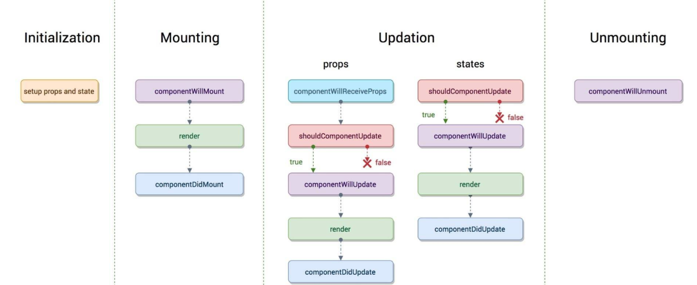
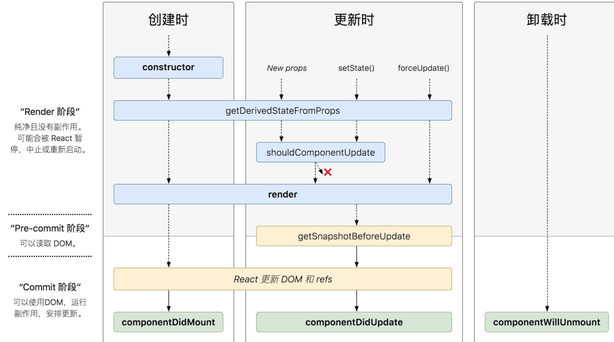

# react 官方脚手架：create-react-app
1. 安装：npm install -g create-react-app
2. 创建项目：create-react-app react-core
3. 修改项目的webpack配置：<https://juejin.im/post/5dedd6c8f265da33d15884bf>
    - 3.1 项目 eject
    - 3.2 替换 react-script 包
    - 3.3 使用 react-app-rewired + customize-cra 自定义配置
        - 3.3.1 安装：`npm i react-app-rewired customize-cra -D`
        - 3.3.2 修改package.json文件
        ```json
        "scripts": {
            "start": "react-app-rewired start",
            "build": "react-app-rewired build",
            "test": "react-app-rewired test --env=jsdom",
            "eject": "react-scripts eject"
        },
        ```
        - 3.3.3 在项目根目录新建config-overrides.js
        ```javascript
        const { override, fixBabelImports, addDecoratorsLegacy } = require("customize-cra");
        module.exports = override(
            // 配置 antd 按需加载，自动引入
            fixBabelImports("import", {
                libraryName: "antd",
                // antd库的目录：../node_modules/antd/es
                libraryDirectory: "es",
                style: "css",
            }),
            //配置装饰器
            addDecoratorsLegacy(), 
        );
        ```
# react 基础知识
1. React 和 ReactDOM
    - React负责逻辑控制: 数据 -> VDOM
    - ReactDOM渲染实际DOM: VDOM -> DOM
2. function组件和class组件
    - class组件: 通常拥有状态和生命周期，继承于React.Component, 在render()里面return出模板
    - function组件: 通常无状态，仅关注内容展示，直接return出渲染结果
    > React16.8开始引入hooks，函数组件也能够拥有状态
3. 状态管理
    - class组件: state && setState
        - 维护状态：`this.state = {counter: 0, num: 1}`
        - setState特性
            - 不能直接修改状态
                - `this.state.counter += 1 //error`
                - `this.setState({counter: this.state.counter + 1}) //right`
            - 批量执行
            ```javascript
                this.setState({A: 'aaa', B: 'bbb'})
                this.setState({A: 'aa'})
                console.log(this.state.A, this.state.B) //'aa' 'bbb'
            ```
            - 异步: setState通常是异步的，因此如果要获取到最新状态值有以下三种方式
                - 传递函数给setState方法
                ```javascript
                this.setState((preState, preProps) => ({
                    counter: preState.counter + 1 //1
                }), () => {
                    console.log(this.state.counter) //1
                })
                this.setState((preState, preProps) => ({
                    counter: preState.counter + 1 //2
                }), () => {
                    console.log(this.state.counter) //2
                })
                ```
                - 使用定时器
                ```javascript
                setTimeout(() => {
                    this.setState({
                        counter: this.state.counter + 1 //1
                    })
                    console.log(this.state.counter) //1
                    this.setState({
                        counter: this.state.counter + 1 //2
                    })
                    console.log(this.state.counter) //2
                }, 0)
                ```
                - 原生事件中修改状态
                ```javascript
                document.getElementById('changeCounter').addEventListener('click', () => {
                    this.setState({
                        counter: this.state.counter + 1 //1
                    })
                    console.log(this.state.counter) //1
                    this.setState({
                        counter: this.state.counter + 1 //2
                    })
                    console.log(this.state.counter) //2
                })
                ```
                > setState只有在合成事件和钩子函数中是异步的，在setState回调函数，原生事件和setTimeout、setInterval中都是同步的？？
    - 函数组件: hooks[useState和useEffect]
4. 事件：绑定this的三种方法
    - 构造函数中绑定并覆盖: `this.change = this.change.bind(this)`
    - 方法定义为箭头函数：`change = () => {}`
    - 事件调用中定义为箭头函数: `onChange = {() => this.change()}`
5. 组件通讯
    - 父传子[props]
    - 子传父[事件，传参]
    - 跨层级[context]
    - 任意两个组件通讯[redux]
    - 双向数据绑定
        - 受控组件：`<input type="text">`, `<textarea>` 和 `<select>` 之类的标签都非常相似,它们使用value + onChange事件实现受控组件。文件 `<input type="file"/>` 标签因为它的 value 只读，所以它是 React 中的一个非受控组件
6. 生命周期
    - V16.3之前的生命周期  
    
    - V16.4之后的生命周期  
      
    - 总结：
        - `componentWillMount`, `componentWillReceiveProps`和`componentWillUpdate`被`getDerivedStateFromProps`取代
        - `getDerivedStateFromProps`会在render前，初始挂载和后续更新时被调用
# react组件化
1. 组件跨层通信 - context
    - 创建上下文：`const {Provider, Consumer} = React.createContext()`
    - 提供者 -- 哪里提供哪里写: `<Provider value={data}>...</Provider>`
    - 消费者 -- 哪里需要哪里写: `<Consumer>{value => <Comp {...value}/>}</Consumer>`
2. 组件复合 - composition
    - 相当于Vue的插槽: slot => props.children
3. 高阶组件 - HOC
    - 高阶组件是一个工厂函数，传入一个组件，返回另一个组件
    - 装饰器写法：需要配置 -- `npm i @babel/plugin-proposal-decorators -D`
4. Hooks[V16.8~]: Hook本质就是JavaScrip 函数，它可以在不编写class组件的情况下使用state 以及其他的React特性
    - 状态钩子: useState
        - 跟class组件中的`this.state`和`this.setState`类似
            - `const [count, setCount] = useState(0)`等价于class组件中`this.state = {count: 0}, this.setState({count: setCount()})`
    - 副作用钩子: useEffect
        - 它跟class组件中的componentDidMount,componentDidUpdate,componentWillUnmount类似
        - 参数：useEffect(副作用函数，副作用执行依赖项)
        - 清除工作：有一些副作用是需要清除的，清除工作十分重要，可以防止引起内存泄露
    - useReducer: 类似于redux
        - 定义reducer: `const fruitsReducer = (state, action) => {}`
        - 使用: `const [fruits, dispatch] = useReducer(fruitsReducer, ['初始化的水果'])`
    - useContext: 类似于class组件中的Context
        - 借助Context本身和Context.Provider: `const Context = React.createContext()`;`const Provider = Context.Provider`
        - 定义store: `const store = {user: 'xu'}`
        - 使用: `<Provider value={store}></Provider>`;`const {user} = useContext(Context)`
    - 拓展
        - Hook规则：<https://zh-hans.reactjs.org/docs/hooks-rules.html>
        - 自定义Hook
            - <https://zh-hans.reactjs.org/docs/hooks-custom.html>
            - <https://juejin.im/post/5df78ba6f265da33d74428f9>
            - <https://juejin.im/post/5dc953235188250c6c41683e>
        - 一些牛逼的自定义Hook：<https://github.com/streamich/react-use>
5. 使用第三方组件
    - antd
        - 安装：`npm install antd --save`
        - 按需加载配置：`npm install react-app-rewired customize-cra babel-plugin-import -D`
        ```javascript
        //根目录创建config-overrides.js
        const { override, fixBabelImports, addDecoratorsLegacy } = require("customize-cra");
        module.exports = override(
            fixBabelImports("import", {
                libraryName: "antd",
                libraryDirectory: "es",
                style: "css",
            }),
            addDecoratorsLegacy(), //配置装饰器
        );
        ```
        ```json
        // package.json
        "scripts": {
            "start": "react-app-rewired start",
            "build": "react-app-rewired build",
            "test": "react-app-rewired test",
            "eject": "react-app-rewired eject"
        },
        ```
    > antd v4 对比 antd v3改动了很多
6. 自定义组件
    - 6.1 模仿Antd设计一个表单组件
        - 高阶组件
        - `React.cloneElement`API
        - React表单的双向数据绑定
        - 单项校验和全局校验
    - 6.2 弹窗类组件 -- 传送门Portal, 动态挂载React组件
        - 方案1[v16之后]: `createPortal(comp, node)`
        - 方案2[v16之前]: `unmountComponentAtNode`和`unstable_renderSubtreeIntoContainer`
            - `componentWillUnmount() {unmountComponentAtNode(node)}`
            - `unstable_renderSubtreeIntoContainer(this, comp, node)`
    - 6.3 树形递归组件
        - 可以直接使用组件的名称，递归调用组件
        - 递归终止条件：hasChildren
7. 组件优化技术 -- 纯组件
    - 7.1 shouldComponentUpdate判断
        - Component不会比较当前和下个状态的props和state。因此，每当shouldComponentUpdate被调用时，组件默认的会重新渲染。优化 ——
        - Component + shouldComponentUpdate判断是否更新：`shouldComponentUpdate(nextProps, nextState) { return !(nextProps === this.props && nextState === this.state)}`
        - 缺点：麻烦
    - 7.2 PureComponent[V15.3~]
        - 当props或者state改变时，PureComponent将对props和state进行浅比较，如果一样，则shouldComponentUpdate返回false
        - 缺点：有使用限制
            - 确保数据类型是值类型
            - 如果是引用类型，确保地址不变，同时不应当有深层次的数据变化
            - 必须是class组件
    - 7.3 React.meno()[V16.6~]
        - React.memo()是一个高阶函数，它与 React.PureComponent类似，但是一个函数组件而非一个类
    - 7.4 vue框架内部已经对此做了优化, 开发者不需要考虑该类问题, 只需要关注自己的应用本身就可以了
# react全家桶 -- Redux
1. reducer: reducer是一个纯函数，接收旧的state和action，返回新的state
    - `(preState, action) => newState`
2. reduce: 之所以将这样的函数称之为 reducer, 是因为这种函数与被传入`Array.prototype.reduce(reducer, ？initialVal)`里的回调函数属于相同的类型
    - eg: `const arr = [1,2,3,4]; const reducer = (pre, next) => pre + next; arr.reduce(reducer, 20); //30`
3. redux: Redux是**JavaScript**应用的状态容器，而不单单是React应用的状态容器
    - 创建store
        - reducer初始化
        - 利用createStore创建store
        ```javascript
        // ./store/redux-counter.js
        const counter = (state:0, action) => {
            switch(action.type) {
                case 'add':
                    return state + 1;
                default: 
                    return state
            }
        }
        export const reduxCounter = createStore(counter)
        ```
    - 使用store
        - getState 获取状态
        - dispatch 提交更新
        - subscribe 订阅更新
        ```javascript
        // ./pages/redux-test.js
        import {reduxCounter} from './store/redux-counter.js'
        export default ReduxTest extends Component {
            componentDidMount() {
                reduxCounter.subscribe(() => this.forceUpdate())
            }
            add() {
                reduxCounter.dispatch({type: 'add'})
            }
            render() {
                const count = reduxCounter.getState()
                //...
            }
        }

        ```
4. react-redux：react-redux是对redux的一层包装，让redux更好服务于React5. 
    - 4.1 基本用法
        - 4.1.1 借助redux 的 createStore 创建store
        ```javascript
        // ./store/react-redux-counter.js
        export const counter = (state:0, action) => {
            switch(action.type) {
                case 'add':
                    return state + 1;
                default: 
                    return state
                }
            }
        // ./store/index.js
        import { createStore } from 'redux'
        import { counter } from './react-redux-counter.js'
        export const reactReduxCounter = createStore(counter)
        ```
        - 4.1.2 借助react-redux 的 Provider API 全局提供 store
        ```javascript
        // index.js
        import { store } from './store/index'
        import { Provider } from 'react-redux'
        ReactDOM.render(
            <Provider store = {store}>
                <App/>
            </Provider>,
            document.getElementById('root')
        )
        ```
        - 4.1.3 借助react-redux 的 connect API 获取状态数据
        ```javascript
        // ./actions/react-redux-test.js
        export const add = () => {return {type: 'add'}}
        // ./pages/react-redux-test.js
        import { connect } from 'react-redux'
        import { add } from '../actions/react-redux-test'
        const mapStateToProps = state => {return {count: state}}
        const mapDispatchToProps = {add}
        @connect(mapStateToProps, mapDispatchToProps)
        export default ReactReduxTest extends Component {
            render() {
                const {count, add} = this.props
            }
        }
        ```
    - 4.2 异步：借助`redux-thunk`中间件
    ```javascript
    // ./store/index.js
    import { applyMiddleware } from 'redux'
    import thunk from 'redux-thunk'
    export const reactReduxCounter = createStore(counter, applyMiddleware('thunk'))
    ```
    - 4.3 模块化：combineReducers
    ```javascript
    // ./store/index.js
    import { combineReducers } from 'redux'
    export const reactReduxCounter = createStore(
        // 模块化：使用多个reducer
        combineReducers({ counter1, counter2 }),
        // 使用thunk和logger中间件
        applyMiddleware(thunk, logger))
    ```
5. redux原理
6. react-redux原理
# react全家桶 -- react-router
1. 安装
    - 1.1 浏览器版本：`npm i react-router-dom -S`
    - 1.2 Native版本：`npm i react-router-native -S`
2. 用法
    - 2.1 基本用法: 
        - 最外层：`<BrowserRouter>`
        - 路由链接：`<Link to='/demo'>`
        - 路由视图渲染：`<Route path='/demo' component={Demo}/>`
        - 精确匹配：`<Route exact>`
        - 独占路由：`<Switch> ... </Switch>`
    - 2.2 动态路由：
        - `<Link to="/detail/123">`
        - `<Link to="/detail/456">`
        - `<Route path = "/detail/:id">`
    - 2.3 嵌套路由:
        - `<Link to = "/child/child1">`
        - `<Link to = "/child/child2">`
        - `<Route path = "/child/child1">`
        - `<Route path = "/child/child2">`
    - 2.4 404页面: 没有路径，必然匹配，放到最后
        - `<Route component = {() => <div>404</div>}>`
    - 2.5 路由守卫
        - 重定向：`<Redirect to={}/>`
    - 2.6 BrowserRouter vs HashRouter
        - BrowserRouter: history模式
        - HashRouter: hash模式  
        
3. 原理
    - 3.1 实现 BrowserRouter
        - 历史记录管理对象history初始化及向下传递
        - location设为state实现变更监听
    - 3.2 实现 Route
        - 路由匹配，内容渲染
    - 3.3 实现 Link
        - 跳转链接：把路径push进history对象
        - 处理点击事件：阻止a默认的跳转行为
    - Tips: `<></>`相当于Vue的template, 可以给组件一个最外层，但却不会在浏览器渲染
# react项目实践
1. redux-saga

2. umi

3. dva

4. 移动端cra


                


